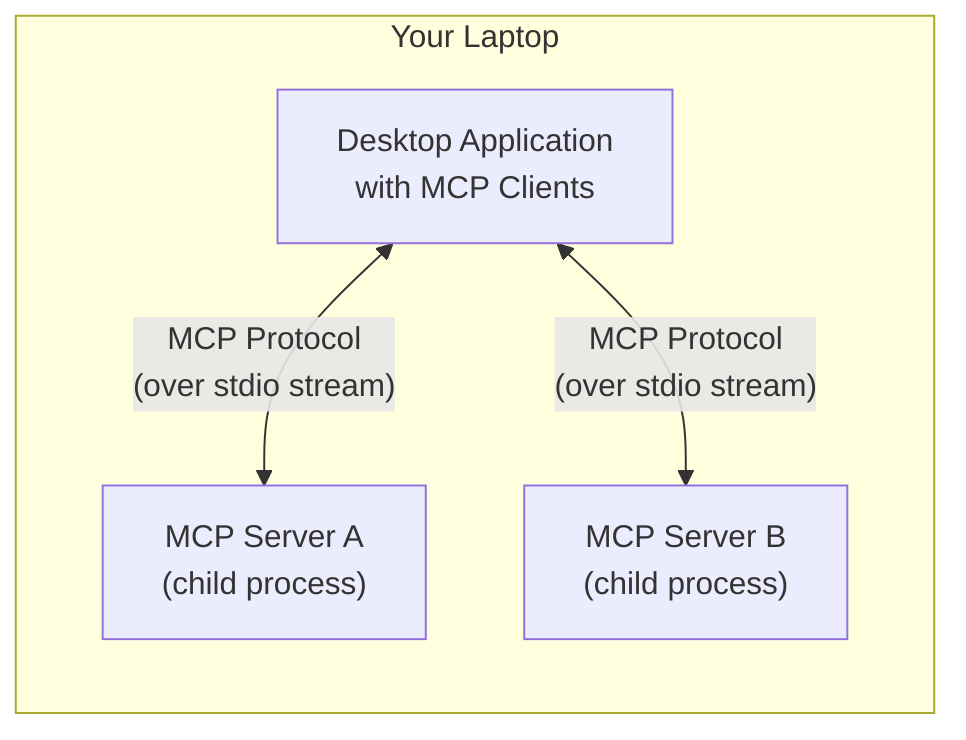
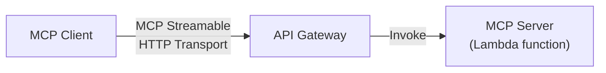

# Facultad de Informática UNLP Weather Station MCP Server

A Model Context Protocol (MCP) server that provides access to real-time weather data from the weather station at the Facultad de Informática, Universidad Nacional de La Plata (UNLP), in La Plata, Argentina.

## Overview

This MCP server connects to the Facultad de Informática's weather station and provides tools to access current weather conditions including temperature, humidity, pressure, wind data, UV index, and precipitation information. Data is sourced from the Facultad de Informática UNLP weather station platform at [clima.info.unlp.edu.ar](https://clima.info.unlp.edu.ar/).

For more information about the weather station, see: https://www.info.unlp.edu.ar/estacion/

## Features

### Available Tools

1. **get_current_weather** - Get comprehensive current weather conditions
2. **get_temperature** - Get current temperature and feels-like temperature  
3. **get_weather_parameter** - Get specific weather parameters:
   - temperature, humidity, pressure, wind_speed, wind_direction
   - uv, rain, rain_rate, dew_point, wind_chill
4. **analyze_weather_conditions** - Get intelligent analysis of current weather conditions

### Data Source

The server fetches data from: `https://clima.info.unlp.edu.ar/last?lang=es`

Sample data format:
```json
{
  "captured_at": "2025-09-18T02:55:00.000Z",
  "temperature": 15,
  "humidity": 87,
  "dew": 13,
  "bar": 1017,
  "uv": 0,
  "wind_chill": 15,
  "wind_speed": 0,
  "rain": 0,
  "rain_rate": 0,
  "wind_direction": "---"
}
```

## Installation & Deployment

This MCP server supports both **local** and **AWS Lambda** deployment.

### Local Deployment



```bash
# Clone and install
git clone https://github.com/juliancasaburi/clima-info-unlp-mcp.git
cd clima-info-unlp-mcp
npm install

# Build and run
npm run build
npm start
```

### AWS Lambda Deployment



Deploy to AWS Lambda with API Gateway:

#### Option 1: CDK Deployment

```bash
# Build and package
npm run build
npm run package

# Deploy with CDK
npx cdk bootstrap aws://YOUR_ACCOUNT/us-east-1  # One-time setup
npx cdk deploy --app "npx tsx cdk-stack.ts"
```

#### Option 2: CloudFormation Deployment

```bash
# Deploy with CloudFormation
npm run deploy:cloudformation
```

This will:
1. Build and package the application
2. Create/update an S3 bucket for deployment artifacts
3. Upload the package to S3
4. Deploy the CloudFormation stack
5. Display the API Gateway endpoint URL

## Usage

### VS Code Integration

Configure in `.vscode/mcp.json`:

```jsonc
{
  "servers": {
    "clima-info-unlp-mcp-local": {
      "type": "stdio",
      "command": "node",
      "args": ["${workspaceFolder}/build/index.js"]
    },
    "clima-info-unlp-mcp-aws": {
      "type": "http",
      "url": "https://clima-info-unlp-mcp.casaburi.dev/mcp"
    }
  }
}
```

### Claude Desktop Integration

Add to Claude Desktop configuration:

```json
{
  "mcpServers": {
    "clima-info-unlp": {
      "command": "node",
      "args": ["/path/to/clima-info-unlp-mcp/build/index.js"]
    }
  }
}
```

## Example Interactions

### Get Current Weather
Ask: "What's the current weather at UNLP?"

### Get Specific Information  
Ask: "What's the current temperature at UNLP?" or "What's the humidity level?"

### Weather Analysis
Ask: "Analyze the current weather conditions at UNLP"

## Development

### Project Structure
```
src/
├── index.ts                    # Local MCP server (stdio)
├── index-lambda-subprocess.ts  # Lambda subprocess handler
├── lambda-api-gateway.ts       # API Gateway handler  
└── weather-core.ts             # Shared weather functionality

scripts/
├── package-api-gateway.cjs     # API Gateway deployment package
└── deploy-cloudformation.cjs   # CloudFormation deployment script

cdk-stack.ts                    # AWS CDK infrastructure
cloudformation-template.yaml   # CloudFormation template (alternative to CDK)
```

### Available Scripts
- `npm run build` - Compile TypeScript
- `npm start` - Run local MCP server
- `npm run dev` - Development mode with tsx
- `npm test` - Build and test
- `npm test` - Build and test

### Deployment Scripts
- `npm run package` - Create deployment package
- `npm run deploy` - Package for deployment
- `npm run deploy:cloudformation` - Deploy using CloudFormation template

## Architecture

### Local Mode
```
VS Code/Claude ↔ stdio ↔ MCP Server ↔ UNLP Weather API
```

### AWS Lambda Mode
```
VS Code/Claude ↔ HTTP ↔ API Gateway ↔ Lambda (AWS Labs MCP Wrapper) ↔ MCP Server subprocess ↔ UNLP Weather API
```

## Technical Details

- **Language:** TypeScript
- **Runtime:** Node.js 22.x
- **MCP SDK:** @modelcontextprotocol/sdk v1.0.4
- **AWS Integration:** @aws/run-mcp-servers-with-aws-lambda v0.4.2
- **Local Transport:** stdio
- **Remote Transport:** HTTP (AWS Labs wrapper handles MCP protocol)

## Cost Considerations (AWS)

- **Lambda:** Pay per invocation (free tier: 1M requests/month)
- **API Gateway:** Pay per API call (free tier: 1M calls/month)  
- **CloudWatch Logs:** Small storage costs for logs
- **Deployment Artifacts:** S3 storage costs are minimal for deployment artifacts.

## Monitoring

### CloudWatch Logs
View Lambda execution logs:
```bash
aws logs describe-log-groups --log-group-name-prefix "mcp-server-clima-info-unlp"
```

### API Gateway Metrics
Monitor in AWS Console: API Gateway → Your API → Monitoring

## License

This project is licensed under the MIT License. See the `LICENSE` file for details.

## Contributing

Contributions are welcome! Feel free to open issues or submit pull requests to improve the project.

1. Fork the repository
2. Create a feature branch
3. Make your changes
4. Submit a pull request

## Support

For issues or questions:
- Create an issue on GitHub
- Check CloudWatch logs for AWS Lambda issues
- Verify UNLP weather station availability at https://clima.info.unlp.edu.ar/
